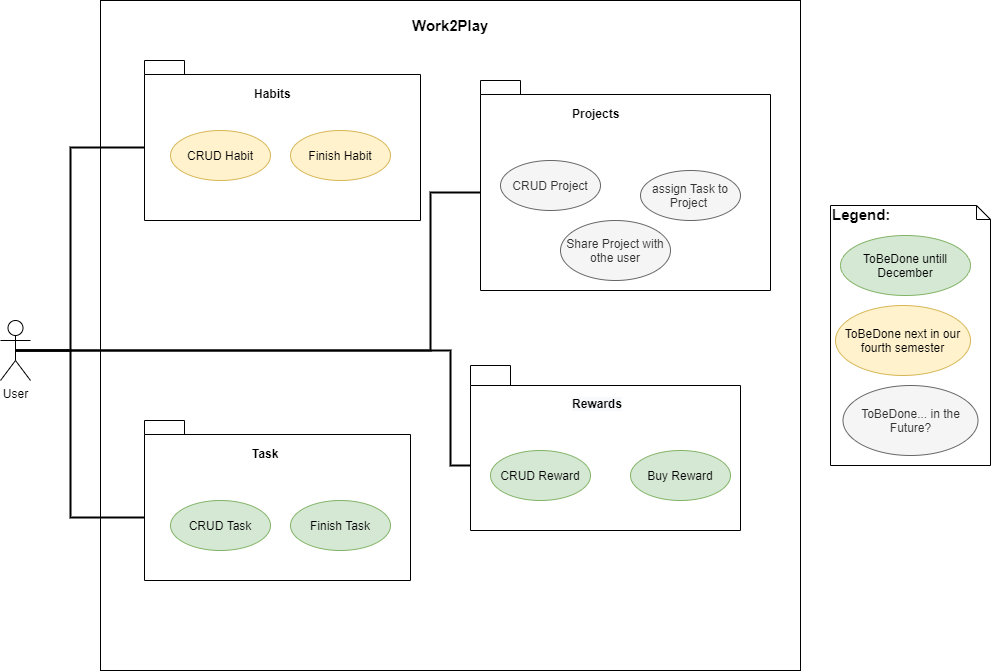

# Work2Play - Software Requirements Specification

## 1. Introduction
### 1.1 Purpose
This SRS describes all specifications for **"Work2Play"**. It will be an App for mobile usage. "Work2Play" allows
users to manage their Tasks with ease and reward themselfes with freetime activities. Also they should be able to share their Tasks with roommates and other people.
"Work2Play" will be explained. Furthermore reliability, reaction speed and other important
characteristics of this project will be specified. This includes design and architectural decisions regarding optimization of
these criteria as well.

### 1.2 Scope

The document is designed for internal purposes only.

### 1.3 Definitions, Acronyms and Abbreviations

| Term     |                                     |
| -------- | ----------------------------------- |
| **SRS**  | Software Requirements Specification |
| **JSON** | JavaScript Object Notation          |
| **API**  | Application Programming Interface   |
| **MTBF** | Mean Time Between Failures          |
| **MTTR** | Mean Time To Repair                 |
| **DTO**  | Data Transfer Object                |
| **HTTP** | Hypertext Transfer Protocol         |
| **FAQ**  | Frequently Asked Questions          |
| **REST** | Representational State Transfer     |

### 1.4 References

| Title                                                                                                 | Date       |
| ----------------------------------------------------------------------------------------------------- | ---------- |
| [Blog](https://work2playtogether.wordpress.com/blog/)                                                      | 21/10/2020 |
| [GitHub](https://github.com/david2628/Work2Play/)                                                     | 21/10/2020 |
| [Use Cases](https://github.com/david2628/Work2Play/blob/main/UseCases) | 21/10/2020 |
| [Test Plan](https://github.com/david2628/Work2Play/blob/main/TestPlan.md) | 10/06/2020 |
| [Funktion Points](https://github.com/david2628/Work2Play/blob/main/Function_Points.xlsx) | 10/06/2020 |
| [Risk Management](https://github.com/david2628/Work2Play/blob/main/risk_management.xlsx) | 10/06/2020 |
| [SAD](https://github.com/david2628/Work2Play/blob/main/SAD/SAD.md) | 10/06/2020 |
| [Demo Video](https://github.com/david2628/Work2Play/blob/main/demo_video.m4v) | 10/06/2020 |
| [Testing Video](https://github.com/david2628/Work2Play/blob/main/cucumber_testing_video.mkv) | 10/06/2020 |
| [App APK](https://github.com/david2628/Work2Play/blob/main/W2P.apk) | 10/06/2020 |

### 1.5 Overview
The next chapters are about our vision, the product specifications and licensing.

## 2. Vision
With Work2Play you are able to create a To Do list to schedule tasks of your every day life. For each completed tasks you can earn credits. You can use these credits to reward yourself by „buying“ free time for activities you enjoy.

If you have assignments with a deadline or repeating events you could plan them in a calendar and set a date and time to get an early reminder.

In addition to that, it is possible to share tasks with your friends or roommates to work on projects simultaneously.

####The following picture shows our overall use case diagram:

## 3. Specific Requirements

### 3.1 Functionality

#### 3.1.1 Tasks Tab
On this tab, the user is able to create and delete tasks and set them to "done". These tasks can be individually configured and return coins by completion. The amount of coins can also be determined by the user himself, and they can be used to buy specific 
rewards. The tasks are permanently locally stored on the app and can be set to repeat or to disappear after completion.

More on that you can find on these use case specifications:
- [CRUD Task](https://github.com/david2628/Work2Play/blob/main/UseCases/CRUD-Task.md)
- [Finish Task](https://github.com/david2628/Work2Play/blob/main/UseCases/UC-Finish_Task.md)

#### 3.1.2 Rewards Tab
On this tab, the user is able to create, delete and buy rewards. Just like the tasks, the rewards can be designed individually in terms of contend of the rewards as well as the required coins to buy them. The are also locally stored on the app and can be set to repeatable or non- repeatable.

More on that you can find on these use case specifications:
- [CRUD Reward](https://github.com/david2628/Work2Play/blob/main/UseCases/CRUD-Reward.md)
- [Buy Reward](https://github.com/david2628/Work2Play/blob/main/UseCases/UC-Buy_Rewards.md)

#### 3.1.3 Habits Tab
On this Tab, the user can create and delete habits and set them to "done". A habit is a task that has to be done one or more times a week. The user can set a coin reward for each time a habit is done and when the "goal-per-week" is reached. The currend progress is stored on the app and resets ervery new week.

More on that you can find on these use case specifications:
- [CRUD Habit](https://github.com/david2628/Work2Play/blob/main/UseCases/CRUD-Habit.md)
- [Finish Habit](https://github.com/david2628/Work2Play/blob/main/UseCases/UC-Finish_Habit.md)

### 3.3 Usability
We plan to design the user interface as simple and intuitive as possible, so that it can be used very fast on the users mobile device.
Every user should be able to utilize our App without instructions.

### 3.4 Design Constraints
- For the development we use mostly IntelliJ IDE to implement our App
- The app is beeing build with Gradle
- For testing our choice is Cucumber with Espresso
- GitHub is our Version control of choice
- Our project management is done with YouTrack
- The Blog and Webpage are on Wordpress
#### 3.4.1 Front End
The main part of our app is written in Java and build with Gradle. As IDE we therefore use JetBrains IntelliJ IDEA with an Android development Plugin.

#### 3.4.2 Database
As for our Database, we use a SQLite Database

#### 3.4.3 Testing
The testing of our user interface is Implemented with Cucumber Feature Files and Gherkin and Android Espresso.

Our unit tests run with JUnit and Mockito.

#### 3.4.4 Code Quality
To improve our code quality, we use:
- Codacy
- Sonarlint Plugin for IntelliJ
- CodeMR Plugin for IntelliJ
- MetricsReloaded Plugin for IntelliJ

#### 3.4.4 Other used Tools and Software
The Project management tool of our choice is Youtrack, we use GitHub as our version controll software, Wordpress for our Blog and Webpage and Discord as our primary tool for comunication.
For sketches and models we use Draw.io, Balsamiq and PlantUML.

### 3.5 Supported Platforms

The App will only availible for Android.

### 3.8 Online User Documentation and Help System Requirements

As mentioned in the chapter: Usability, the app should be intuitive to use, so we see no point in some kind of tutorial.

## 4. Supporting Information
 Supporting information on Work2Play can be found on our SAD, the use case definitions and all the other files on this repository, which are linked in the beginning of this document, as well as our Blog, which is also referenced there.
