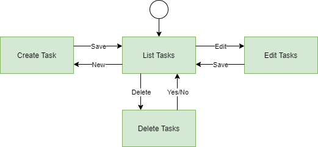

# Use-Case Specification: Create Task

# 1. Shopping List

## 1.1 Brief Description
This use case allows users to list all tasks, create tasks, edit tasks and delete tasks. So it describes the creation, reading, updating and deleting of Tasks (CRUD).

## 1.2 Mockups
### Task List
### Create Task
### Edit Task
### Delete Task

# 2. Flow of Events

## 2.1 Basic Flow

### Activity Diagram

### .feature File

## 2.2 Alternative Flows
n/a

# 3. Special Requirements
n/a

# 4. Preconditions

# 5. Postconditions

### 5.1 Save changes / Sync with server

# 6. Function Points
