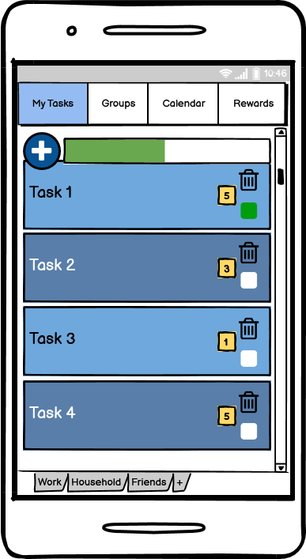
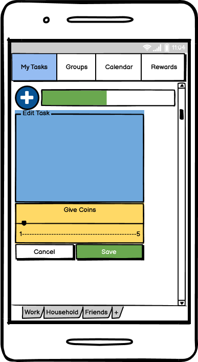
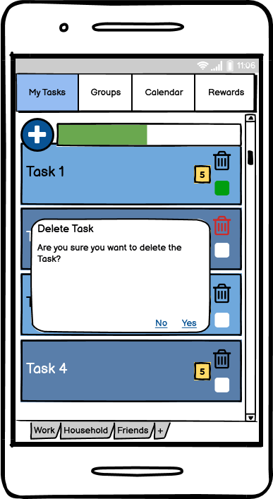

# Use-Case Specification: Create Task

# 1. Create Task

## 1.1 Brief Description
This use case allows users to list all tasks, create tasks, edit tasks and delete tasks. So it describes the creation, reading, updating and deleting of Tasks (CRUD).

## 1.2 Mockups
### Task List

### Create Task

### Edit Task

### Delete Task

# 2. Flow of Events

## 2.1 Basic Flow

### Activity Diagram

## 2.2 Alternative Flows
n/a

# 3. Special Requirements
n/a

# 4. Preconditions

The app must be open.

# 5. Postconditions

### 5.1 Create Task
After a task is created the user automatically returns to the Task List and the new task appers.
### 5.2 Edit Task
After editing a task the user automatically returns to the Task List and the updated task is shown.
### 5.3 Delete Task
After deleting a task the user automatically returns to the Task List and the deleted is removed.

# 6. Function Points
n/a
