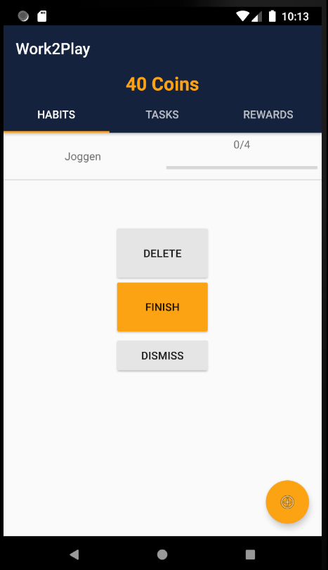
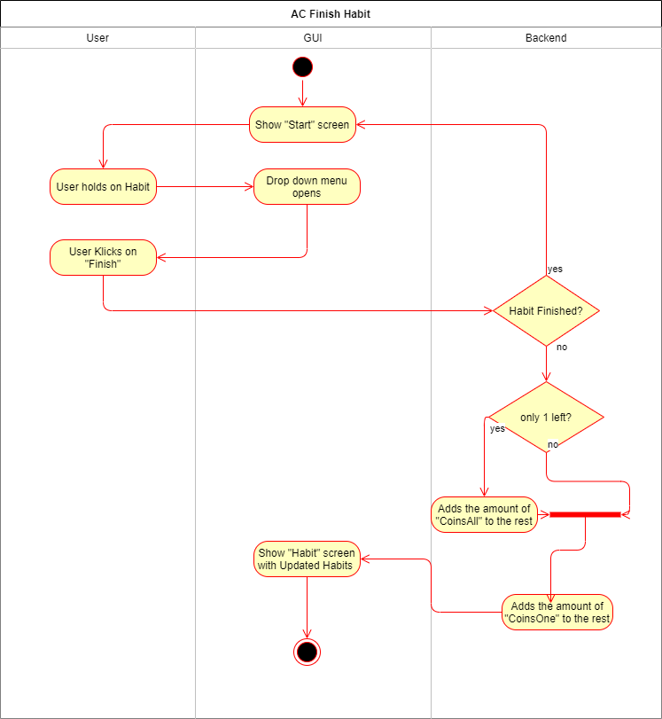

Habit# Use-Case Specification: Manipulate HABIT

# 1. Manipulate Habit

## 1.1 Brief Description
This use case allows users to list all habits, create, edit and delete rewards. So it describes the creation, reading, updating and deleting of rewards (CRUD).


## 1.2 Mockups
### Habit List

### Create Habits

### Edit/Delete Habits



# 2. Flow of Events

## 2.1 Basic Flow

### Activity Diagram



### .feature File
[Habits Feature File](https://github.com/rbnsch/Work2Play/blob/master/app/src/androidTest/assets/features/habit.feature)

``` feature
Feature: Habit(CRUD)
  This feature file is a CRUD and tests the creation and deletion of habits.

  Background:
    Given I am in Habits Tab

  Scenario Outline: Create Habit
    When I click on "+" button
    And AddHabit Screen is shown
    And I set name for Habit <habit>
    And I set amount of Habit <countCompl>
    And I set coins as reward for one part <singleCoins>
    And I set coins as reward for completely finished habit <rewardCoins>
    And I click "SAVE" button
    Then new habit is saved
    And I am moved back to habit tab
    And new habit is shown
    Examples:
      | habit | countCompl  | singleCoins | rewardCoins |
      | Jogging | 4         | 10          | 15          |
      | vacum   | 5         | 15          | 10          |
      | cooking not ordering takeaway | 10 | 25 | 50 |

  Scenario Outline: Delete Habit
    And at least one habit is already created
    When I hold click on habit <habit>
    And I click "DELETE"
    Then reward is deleted
    Examples:
      | habit |
      | jogging |
      | vacum |
      | cooking |

```


## 2.2 Alternative Flows
n/a

# 3. Special Requirements
n/a

# 4. Preconditions

The app must be open.

# 5. Postconditions

### 5.1 Create Habit
After a habit is created the user automatically returns to the habit list and the new habit appers.
### 5.2 Finishing Habit
After editing a habit the user automatically returns to the habit list and the updated habit is shown.
### 5.3 Delete Habit
After deleting a habit the user automatically returns to the habit list and the deleted habit is removed.

# 6. Function Points
n/a
