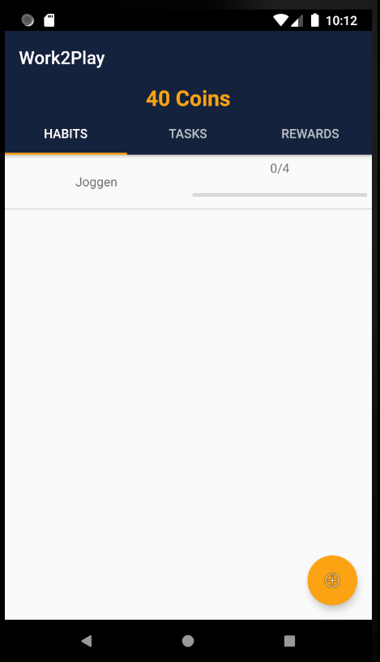

Habit# Use-Case Specification: Manipulate HABIT

# 1. Manipulate Habit

## 1.1 Brief Description
This use case allows users to list all habits, create, edit and delete rewards. So it describes the creation, reading, updating and deleting of rewards (CRUD).


## 1.2 Mockups
### Habit List

### Create Habits

### Edit/Delete Habits


# 2. Flow of Events

## 2.1 Basic Flow

### Activity Diagram


### .feature File
tbd
[Habits Feature File](https://github.com/rbnsch/Work2Play/blob/master/app/src/androidTest/assets/features/reward.feature)

``` feature
Feature: Habit(CRUD)
  Background:
    Given I am in Habits tab

  Scenario Outline: Create Habit
    When I click on "+" button
    And AddHabit Screen is shown
    And I set name for reward <reward>
    And I set amount of coins as cost <cost>
    And I select repeatable or not <repeatable>
    And I clock "SAVE" button
    Then new reward is saved
    And I am moved back to rewards tab
    And new reward is shown
    Examples:
      | reward                  | cost  | repeatable |
      | watching a movie (2h30) | 50    | yes        |
      | watch one episode (1h)  | 20    | yes        |
      | Go to pub with Karl     | 85    | no         |

  Scenario Outline: Delete Habit
    And at least one reward is already created
    When I hold click on reward <reward>
    And I clock on "DELETE"
    Then reward is deleted
    Examples:
      | reward |
      | watching a movie (2h30) |
      | Go to pub with Karl     |
      | watch one episode (1h)  |
      |                         |

  Scenario Outline: Buy repeatable reward
    And at least one reward is already created
    When I click on reward <reward>
    And reward is repeatable <repeatable>
    And I have more coins than it costs  <balance> <cost>
    Then cost is substracted form balance
    And I go back to rewards tab
    Examples:
      | reward                  | cost  | repeatable | balance |
      | watching a movie (2h30) | 50    | yes        | 100     |
      | watch one episode (1h)  | 20    | yes        | 5       |
      | Go to pub with Karl     | 85    | no         | 90      |

  Scenario Outline: Buy non repeatable reward
    And at least one reward is already created
    When I click on reward <reward>
    And reward is not repeatable <repeatable>
    And I have more coins than it costs  <balance> <cost>
    Then cost is substracted form balance
    And reward is deleted
    And I go back to rewards tab
    Examples:
      | reward                  | cost  | repeatable | balance |
      | watching a movie (2h30) | 50    | yes        | 100     |
      | watch one episode (1h)  | 20    | yes        | 5       |
      | Go to pub with Karl     | 85    | no         | 90      |

```


## 2.2 Alternative Flows
n/a

# 3. Special Requirements
n/a

# 4. Preconditions

The app must be open.

# 5. Postconditions

### 5.1 Create Habit
After a habit is created the user automatically returns to the habit list and the new habit appers.
### 5.2 Finishing Habit
After editing a habit the user automatically returns to the habit list and the updated habit is shown.
### 5.3 Delete Habit
After deleting a habit the user automatically returns to the habit list and the deleted habit is removed.

# 6. Function Points
n/a
