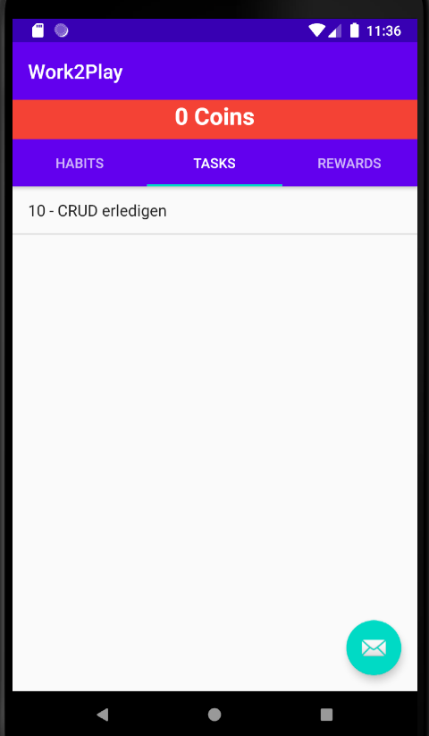
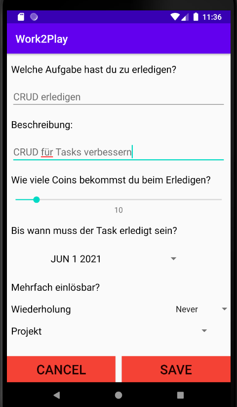
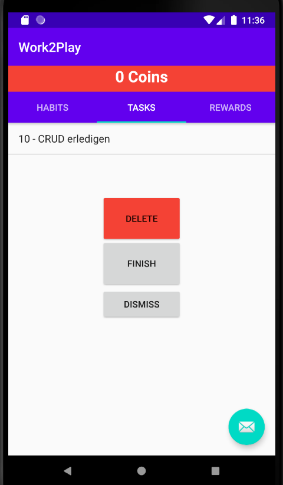
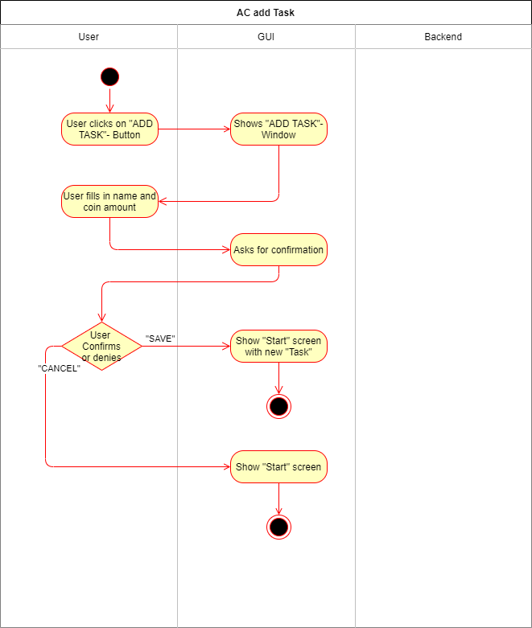

# Use-Case Specification: Manipulate Task

# 1. Manipulate Task

## 1.1 Brief Description
This use case allows users to list all tasks, create, edit and delete tasks. So it describes the creation, reading, updating and deleting of Tasks (CRUD).


## 1.2 Mockups
### Task List

### Create Task

### Edit/Delete Task



# 2. Flow of Events

## 2.1 Basic Flow

### Activity Diagram



### .feature File

[Task Feature File](https://github.com/rbnsch/Work2Play/blob/master/app/src/androidTest/assets/features/task.feature)

``` feature
Feature: Task(CRUD)
  This feature file is a CRUD and tests the creation and deletion of tasks.

  Background:
    Given I am in the Tasks tab

  Scenario Outline: Create Task
    When I click on the "+" button
    And AddTask screen is shown
    And I set name for task <task>
    And I set amount of coins as rewards <coins>
    And I set date <date>
    And I select repeatable or not <repeatable>
    And I select project <project>
    And I click the  "SAVE" button
    Then new task is saved
    And I am moved back to Tasks tab
    And new Task is shown
    Examples:
      | task                | coins | date      | repeatable | project |
      | finish CV           | 25    | 20.06.21  | no         | job     |
      | clean room          | 10    | 04.09.22  | yes        | home    |
      | bring car to garage | 15    | 05.08.21  | no         | car     |

  Scenario Outline: Delete Task
    And at least one Task is already created
    When I hold click on a task <task>
    And I presses the "DELETE" button
    Then Task is deleted
    And menu disappears
    Examples:
      | task |
      | finish CV           |
      | clean room          |
      | bring car to garage |


```


# 3. Preconditions

The app must be open.

# 4. Postconditions

### 4.1 Create Task
After a task is created the user automatically returns to the Task List and the new task appers.
### 4.2 Edit Task
After editing a task the user automatically returns to the Task List and the updated task is shown.
### 4.3 Delete Task
After deleting a task the user automatically returns to the Task List and the deleted is removed.

# 5. Function Points
n/a
