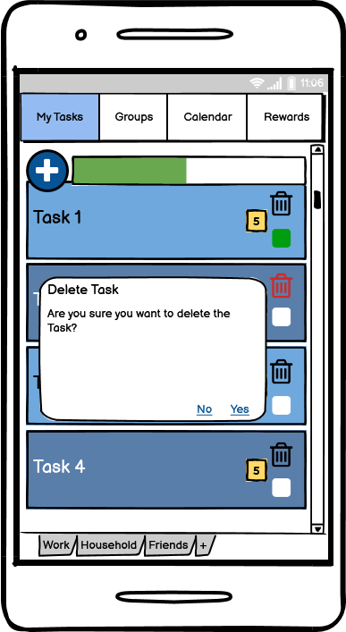

# Use-Case Specification: Manipulate Task

# 1. Manipulate Task

## 1.1 Brief Description
This use case allows users to list all tasks, create, edit and delete tasks. So it describes the creation, reading, updating and deleting of Tasks (CRUD).

## 1.2 Mockups
### Task List

### Create Task

### Edit Task

### Delete Task

# 2. Flow of Events

## 2.1 Basic Flow

### Activity Diagram

### .feature File

# 3. Preconditions

The app must be open.

# 4. Postconditions

### 4.1 Create Task
After a task is created the user automatically returns to the Task List and the new task appers.
### 4.2 Edit Task
After editing a task the user automatically returns to the Task List and the updated task is shown.
### 4.3 Delete Task
After deleting a task the user automatically returns to the Task List and the deleted is removed.

# 5. Function Points
n/a
