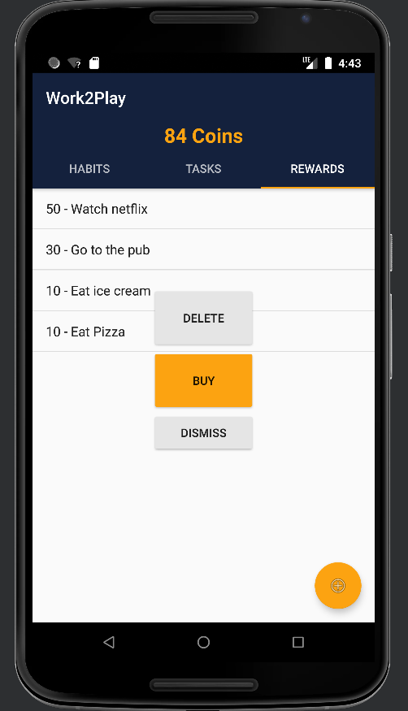
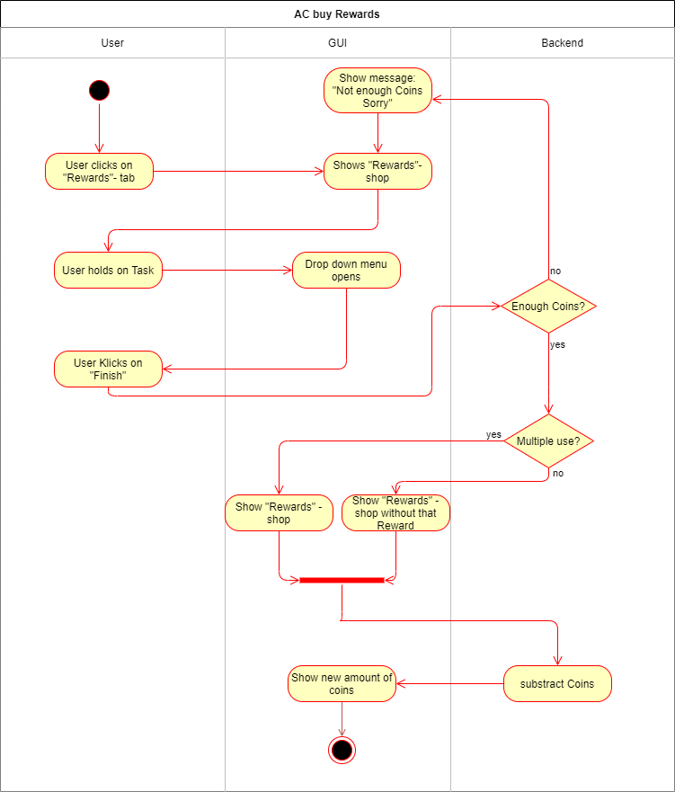

# Use-Case Specification: Buy Rewards

# 1. Buy Rewards

## 1.1 Brief Description
This use case allows users to buy Rewards for their earned coins.

## 1.2 Mockup

### Buy Reward


# 2. Flow of Events

## 2.1 Basic Flow

### Activity Diagram


### .feature File

``` feature
Feature: Buy Reward
  his feature file tests buying rewards.
  It checks if there are enough coins and then distinguishes if you can redeem the reward more than once.

  Background:
    Given I am in the Rewards Tab
    When I hold click on a Reward


  @buy-rewards-feature
  Scenario: Successfully buy unique Reward
    And I have enough coins
    And the reward is set to unique
    And I click on the Buy Reward button
    Then the required coins are subtracted
    And I go back to the Rewards Tab
    And the Reward is removed

  @buy-rewards-feature
  Scenario: Successfully buy non unique Reward
    And I have enough coins
    And the reward is set to non unique
    And I click on the Buy Reward button
    Then the required coins are subtracted
    And I go back to the Rewards Tab

  @buy-rewards-feature
  Scenario: Unsuccessfully buy Reward
    And I don't have enough coins
    And I click on the Buy Reward button
    Then I go back to the Rewards Tab
    And toast: "not enough coins" is shown
    
```

## 2.2 Alternative Flows
n/a

# 3. Special Requirements
n/a

# 4. Preconditions
The user has already done some tasks and earned some coins.

# 5. Postconditions

### 5.1 Buy Reward
After a reward is buyed the user returns to the Reward List.


# 6. Function Points
n/a
