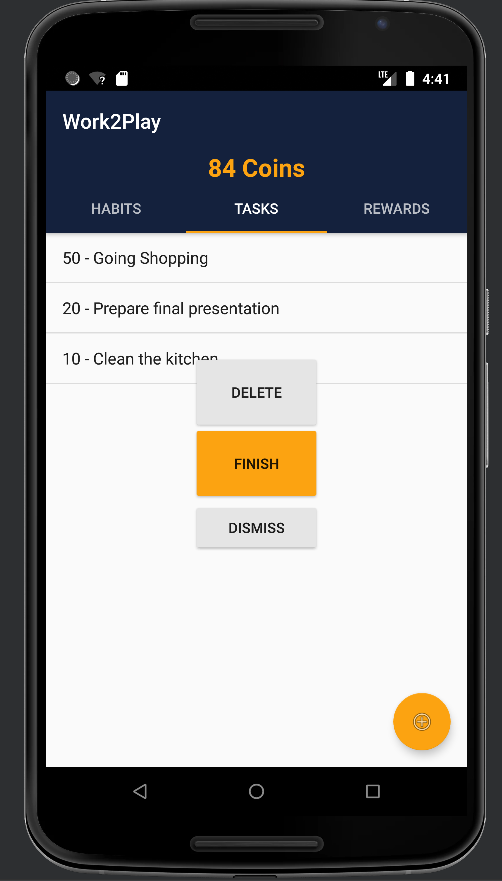

# Use-Case Specification: Finish Task

# 1. Buy Rewards

## 1.1 Brief Description
This use case allows the user to finish a task and earn coins as a reward.

## 1.2 Mockup



# 2. Flow of Events

## 2.1 Basic Flow

### Activity Diagram


### .feature File


``` feature
Feature: Finish Task
  This feature file tests the completion of tasks and whether it is deleted after completion.

  Background:
    Given I am in the Tasks Tab
    When I hold click on a Task

  @finish-task-feature
  Scenario: Finish unique Task
    And Task is not repeatable
    And I click on the Finish Task Button
    Then Coins are added
    And I go back to the Task Tab
    And Task is removed

  @finish-task-feature
  Scenario: Finish repeating Task
    And Task is repeatable
    And I click on the Finish Task Button
    Then Coins are added
    And I go back to the Task Tab

    
```

## 2.2 Alternative Flows
n/a

# 3. Special Requirements
n/a

# 4. Preconditions


# 5. Postconditions

### 5.1 Buy Reward


# 6. Function Points
n/a
