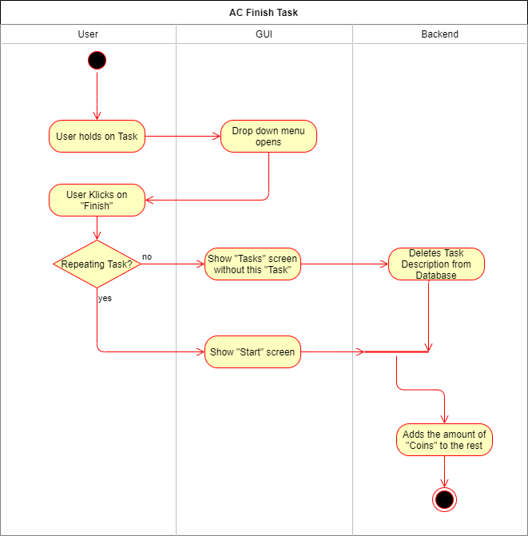

# Use-Case Specification: Finish Task

# 1. Buy Rewards

## 1.1 Brief Description
This use case allows the user to finish a task and earn coins as a reward.

## 1.2 Mockup

# 2. Flow of Events

## 2.1 Basic Flow

### Activity Diagram

### .feature File

## 2.2 Alternative Flows
n/a

# 3. Special Requirements
n/a

# 4. Preconditions

# 5. Postconditions

### 5.1 Buy Reward

# 6. Function Points
n/a
